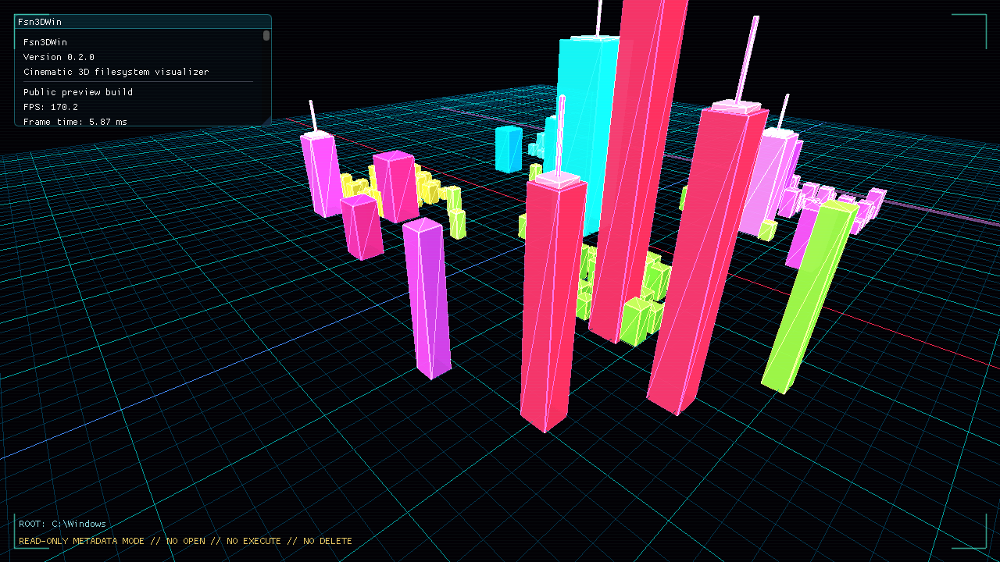
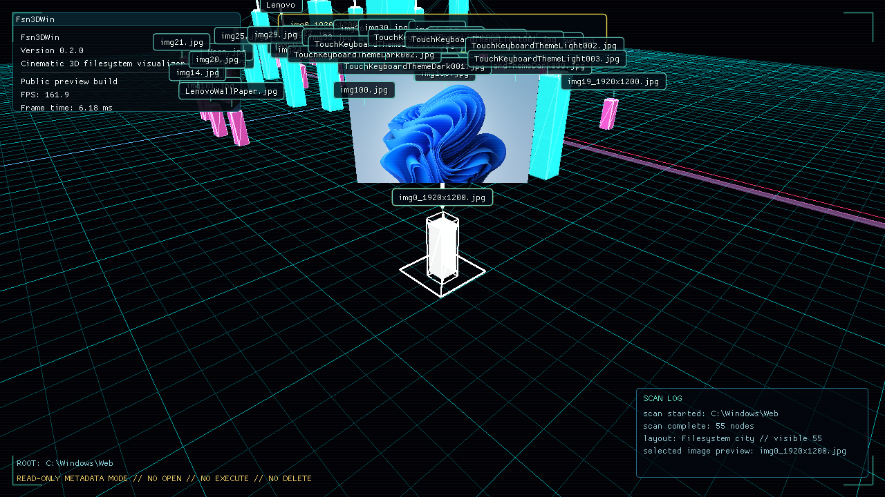

# Fsn3DWin


Fsn3DWin is a cinematic 3D filesystem visualizer for Windows. It turns a folder tree into a glowing neon file city with directory towers, file blocks, scan waves, labels, selection beacons, and a presentation mode inspired by SGI FSN and movie-style hacker interfaces.

It is intentionally read-only. It is not a file manager. It is built to look spectacular while safely exploring filesystem metadata.





## Highlights

- Native Windows C++20 desktop app.
- GPU instanced OpenGL rendering for thousands of file nodes.
- Read-only `std::filesystem` metadata scanner by default.
- Clear filename/folder labels, selected-name banner, and FSN-style hierarchy wires.
- 3D photo preview billboard for selected image files.
- Cinematic fly camera, presentation orbit, clean HUD mode, and screenshot hotkey.
- Search and category filters for scanned file worlds.
- Optional danger zone for opening files or moving a selected file to the Recycle Bin.
- Neon Hacker, Jurassic SGI, and Clean Dark visual themes.
- Portable release build, no installer required.

## Safety Model

Fsn3DWin starts in read-only browser mode. Normal scanning reads filesystem metadata such as names, paths, sizes, types, and directory relationships.

Selecting an image file can decode that image for an in-scene preview. This reads the selected image file only and does not modify it.

Opening files and deleting files are disabled by default. The HUD danger zone must be explicitly enabled before the app can ask Windows to open a selected item. Moving a file to the Recycle Bin additionally requires a second warning checkbox and typing `DELETE`. Directory deletion is intentionally unavailable.

The screenshot feature writes BMP files to the app-owned `screenshots/` folder in the current run directory. That folder is ignored by git.

## Download

Use the latest GitHub release and download the portable Windows zip:

```text
Fsn3DWin-0.2.0-windows-x64.zip
```

Extract it and run:

```powershell
.\Fsn3DWin.exe
```

The portable package includes the app executable and required runtime DLLs produced by the Windows build.

## Build From Source

### Requirements

- Windows 10/11
- Visual Studio 2022 with Desktop development with C++
- CMake 3.24 or newer
- vcpkg
- OpenGL 4.1 compatible GPU/driver

### vcpkg

Use an existing vcpkg install:

```powershell
$env:VCPKG_ROOT = "C:\path\to\vcpkg"
```

Or bootstrap a repo-local copy:

```powershell
git clone https://github.com/microsoft/vcpkg .tools\vcpkg
.\.tools\vcpkg\bootstrap-vcpkg.bat
$env:VCPKG_ROOT = "$PWD\.tools\vcpkg"
```

Dependencies are declared in `vcpkg.json` and restored through CMake manifest mode.

### Configure

```powershell
.\scripts\configure_windows.ps1
```

Equivalent direct command:

```powershell
cmake -S . -B build -G "Visual Studio 17 2022" -A x64 -DCMAKE_TOOLCHAIN_FILE="$env:VCPKG_ROOT\scripts\buildsystems\vcpkg.cmake"
```

### Build

```powershell
.\scripts\build_windows.ps1 -Config Release
```

Debug build:

```powershell
.\scripts\build_windows.ps1 -Config Debug
```

## Run

Run the demo scene:

```powershell
.\build\Release\Fsn3DWin.exe
```

Start with a specific scan root:

```powershell
.\build\Release\Fsn3DWin.exe --root "C:\Windows" --max-depth 3 --max-nodes 2500
```

Start scanning immediately:

```powershell
.\build\Release\Fsn3DWin.exe --root "C:\Windows" --max-depth 3 --max-nodes 2500 --auto-scan
```

Start a generic image-preview demo:

```powershell
.\build\Release\Fsn3DWin.exe --root "C:\Windows\Web" --max-depth 4 --max-nodes 700 --auto-scan --select-first-image
```

Or use the helper script:

```powershell
.\scripts\run_windows.ps1 -Config Release -Root "C:\Windows" -MaxDepth 3 -MaxNodes 2500
```

## Controls

| Input | Action |
| --- | --- |
| `WASD` | Fly camera |
| `Space` | Move up |
| `Ctrl` or `C` | Move down |
| Right mouse | Mouse look |
| Mouse wheel | Adjust movement speed |
| Left click | Select node in Real Scan Scene |
| `Escape` | Clear selection |
| `F` | Focus camera on selected node |
| `Ctrl+C` | Copy selected path to clipboard |
| `P` | Toggle presentation mode |
| `H` | Toggle clean HUD |
| `F12` | Save screenshot to `screenshots/` |

Danger actions are controlled from the HUD and are off by default.

## Command-Line Options

```text
--root <path>       Initial root path for the scan panel
--max-depth <N>     Initial maximum scan depth
--max-nodes <N>     Initial maximum node count
--auto-scan         Start a read-only scan immediately
--select-first-image Select first image after scan for preview demos
--screenshot-after <seconds> Save a screenshot after startup
--quit-after <seconds> Close the app after startup
--help              Show help
```

## Screenshots

The checked-in screenshots are captured from the synthetic demo scene and from `C:\Windows` with a shallow node limit. They avoid private user folders and personal filenames.

Runtime screenshots are written to:

```text
screenshots/
```

That runtime folder is ignored by git. Public README images live in:

```text
docs/screenshots/
```

## Troubleshooting

- If CMake cannot find vcpkg, set `VCPKG_ROOT` or bootstrap vcpkg into `.tools\vcpkg`.
- If the Visual Studio generator is missing, install Visual Studio 2022 with Desktop development with C++.
- If OpenGL startup fails, update GPU drivers and verify OpenGL 4.1+ support.
- If scanning feels slow, lower `Max nodes` or `Max depth`; scans are read-only and cancellable.
- If the app opens in demo mode, choose a root folder and press `Scan`, or launch with `--auto-scan`.

## Project Scope

Fsn3DWin is an epic visual browser, not a replacement for Windows Explorer. The goal is a cinematic way to inspect the shape of a filesystem, preview visual assets, make screenshots, and fly through a glowing data city.

The original SGI FSN was an experimental IRIX 3D filesystem navigator. It represented directories as hierarchy pedestals, files as boxes, and connected the structure with navigable wires. Fsn3DWin borrows that idea while adding modern Windows scanning, labels, image preview, and explicit safety gates for dangerous actions.
